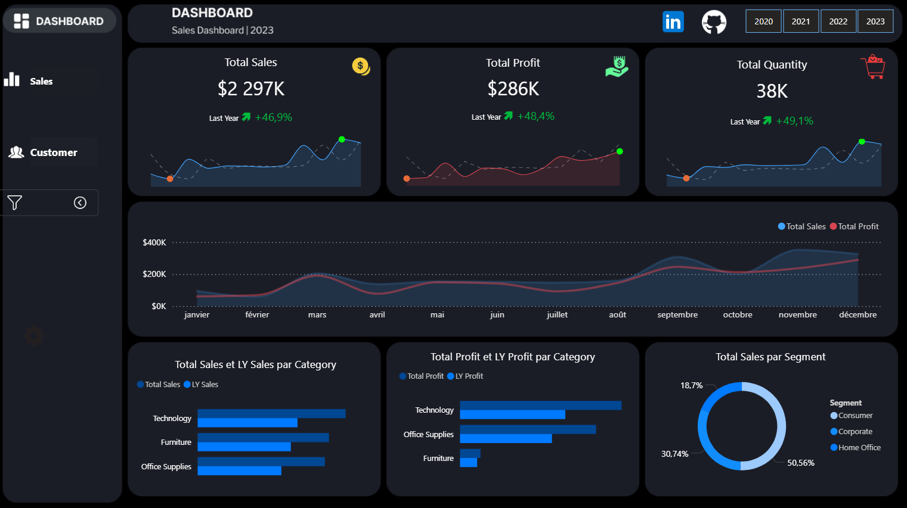
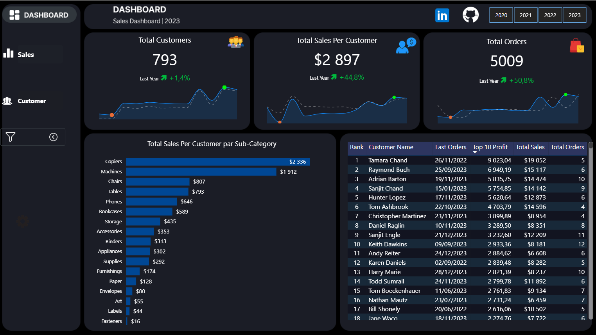

# Sales & Customer Dashboard - Power BI

This project features an interactive **Sales & Customer Performance Dashboard** built with Power BI, designed to transform raw sales data into actionable business insights through comprehensive KPI tracking and advanced visual analytics.

  
  

## 📑 Table of Contents

- [Overview](#overview)
- [Project Objectives](#project-objectives) 
- [Key Features](#key-features)
- [Dashboard Metrics](#dashboard-metrics)
- [Technology Stack](#technology-stack)
- [How to View](#how-to-view)
- [Future Enhancements](#future-enhancements)
- [Author](#author)

## 📊 Dashboard Overview

### Sales Performance Dashboard

### Customer Analytics Dashboard  

## 🎯 Project Objectives

**Track Key KPIs**: Monitor essential business metrics including Total Sales ($2.297K), Total Profit ($286K), and Quantity Sold (38K units) with Year-over-Year growth analysis.

**Analyze Performance Trends**: Visualize sales and profit evolution across different time periods to identify seasonal patterns and growth opportunities.

**Segment Business Performance**: Break down performance by Product Category (Technology, Furniture, Office Supplies) and Customer Segment (Consumer, Corporate, Home Office).

**Evaluate Customer Value**: Identify Top 10 Most Profitable Customers and analyze customer purchasing behavior to optimize retention strategies.

**Monitor Operational Efficiency**: Track Total Orders (5009) and Customer Count (793) to measure business engagement and transaction volume.

## ✨ Key Features & Insights

### 📈 Executive Sales KPIs
- **Total Sales**: $2.297K (46.9% growth vs. previous year)
- **Total Profit**: $286K (48.4% growth vs. previous year) 
- **Quantity Sold**: 38K units (49.1% growth vs. previous year)

### 🎯 Performance Segmentation
- **Category Performance**: Technology leads in both sales and profit generation
- **Customer Segments**: Consumer segment dominates sales volume
- **Regional Distribution**: Comprehensive sales breakdown across all operating regions

### 👥 Customer Intelligence
- **Top 10 Customers**: Tamara Chand leads with $19,052 total sales and $9,023 profit
- **Customer Analytics**: Average sales per customer at $2,897 (44.8% YoY growth)
- **Order Analysis**: 5009 total orders with 50.8% year-over-year growth

### 🔍 Interactive Analytics
- **Dynamic Filtering**: Filter by region, time period, product category, and customer segment
- **Cross-Visual Highlighting**: Click any data point to filter entire dashboard
- **Drill-through Capabilities**: Navigate from summary metrics to detailed transaction data

## 📊 Dashboard Metrics

| Metric | Description | Formula |
|--------|-------------|---------|
| **Total Sales** | Total revenue from all completed orders | `SUM(Sales)` |
| **Total Profit** | Net earnings after cost deductions | `SUM(Profit)` |
| **Profit Margin (%)** | Percentage of profit from total sales | `(SUM(Profit) / SUM(Sales)) * 100` |
| **YoY Growth** | Year-over-year performance comparison | `(Current Year - Previous Year) / Previous Year` |
| **Total Customers** | Unique customers with purchases | `DISTINCTCOUNT(CustomerID)` |
| **Total Orders** | Number of transactions recorded | `COUNT(OrderID)` |
| **Avg Sales per Customer** | Average revenue per customer | `SUM(Sales) / DISTINCTCOUNT(CustomerID)` |

## 🛠️ Technology Stack

| Component | Technology |
|-----------|------------|
| **Visualization Platform** | Microsoft Power BI |
| **Data Source** | Excel/CSV files |
| **Data Transformation** | Power Query |
| **Data Modeling** | Star Schema |
| **KPI Calculations** | DAX (Data Analysis Expressions) |
| **Data Cleaning** | Power Query Editor |

## 🚀 How to View

### Interactive Dashboard
Experience the full interactive Power BI dashboard with all filtering and drill-down capabilities:

➡️ **[View Live Dashboard on Power BI Service](https://app.powerbi.com/view?r=eyJrIjoiMmVlYzM2NWUtNWZhNC00MTUxLWFmNjAtNDg4NTEyODc5NWY3IiwidCI6IjIzZGY3Yzg1LTExNzEtNDY4NS1iNjYxLWIzOGQzZDEwZDJmMSJ9&pageName=b1e2c48aaafb3dae9bcd)**

### Dashboard Features
- **🔹 Interactive Navigation**: Switch between Sales and Customer dashboards using tab navigation
- **🔹 Dynamic Filtering**: Filter by date range, region, product category, customer segment
- **🔹 Cross-filtering**: Click any visual to filter related data across entire dashboard
- **🔹 Drill-through**: Navigate from summary KPIs to detailed transaction level
- **🔹 Export Capabilities**: Download visuals and data for reports and presentations
- **🔹 Responsive Design**: Optimized for desktop and mobile viewing

## 🔮 Future Enhancements

This dashboard represents the core analytics module of a comprehensive business intelligence solution. Planned expansions include:

### 📍 Regional Intelligence Module
- Interactive geographic mapping of sales performance
- Regional profitability and growth trend analysis
- Territory-based sales team performance tracking
- Market penetration and coverage analytics

### 📦 Product Analytics Suite
- Product-level profitability and margin analysis
- Inventory turnover and stock optimization metrics
- Product lifecycle and performance trending
- Category mix optimization recommendations

### 👥 Advanced Customer Analytics
- Customer segmentation by sub-category and profitability
- Sales per customer and average revenue per customer tracking
- Identification of best customers and retention strategies
- Personalized marketing campaign performance

## 💼 About This Project

This Power BI dashboard demonstrates advanced capabilities in:

- **Data Modeling**: Efficient star schema design for optimal performance
- **DAX Mastery**: Complex calculations for dynamic KPI tracking
- **Visual Storytelling**: Clean, intuitive, and professional dashboard design
- **Business Intelligence**: Transforming raw data into strategic insights
- **User Experience**: Interactive elements that enhance data exploration

The project showcases expertise in end-to-end analytics solution development, from data preparation to executive-level reporting.

## 👤 Author

**Habib Aidara**

Data Analyst | Analyst Pricing | Data Stratgy| BI Engineer | Power BI Developer | Data Scientist

💼 [LinkedIn](https://linkedin.com/in/habibaidara)  
🐙 [GitHub](https://github.com/habibaidara)  
📧 Open to collaboration and opportunities

---

**Tags**: `#PowerBI` `#DataAnalytics` `#BusinessIntelligence` `#Dashboard` `#DataVisualization` `#SalesAnalytics` `#CustomerAnalytics` `#DataDriven`
